# SeSAC 모의투자 프로젝트 *투싹(Tussak)*📈

## 💡 기획 배경
- 실제 투자 전 안전한 경험 및 금융 소양을 기를 수 있는 플랫폼 제공
- 건강한 투자 습관 형성

## 🚩 대상
- 금융에 대해 어렵게 생각하는 10대, 20대
- 주식 투자를 시작하고 싶지만 어려운 초보자
- 주식 투자에 흥미를 느끼지 못하는 사람

## 🌟 기대 효과
- 주식 초보자에게 재미와 학습을 동시에
- 주식을 더 공부하고 싶게 만들게 하도록
- 제대로 공부하지 않고 주식을 해왔던 사람들로 하여금 더 건강한 투자를 할 수 있게

## 💻 주요 기능
📊 실제 시장 데이터 활용 모의 주식 투자
🤖 ChatGPT 챗봇을 통함 주식 용어 공부
📰 뉴스를 통한 HOT 키워드 분석
🥇 친구와 랭킹으로 경쟁

## 🔧 기술 스택

 

  ### Frontend
  
  
  
  
  ### Backend
  
  
  
  ### Database
  
  
  
  ### AI & Libraries
  
  
  
  
  
  
  
  ### External APIs
  
  
  
  
  
  ### DevOps & Deployment
  
  
  
  
  
  
  
  

| Category | Technology | Version |
|----------|------------|---------|
| **Frontend** | Node.js | 24.11 |
| | npm | 11.6.1 |
| | React | 19.1.1 |
| | React Router | 7.8.2 |
| | Tailwind CSS | 3.4.17 |
| **Backend** | Python | 3.10 |
| | Flask | 3.1.2 |
| | Flask-SQLAlchemy | 3.1.1 |
| | PyMySQL | 1.1.2 |
| **Database** | MySQL | 8.0.43 |
| | Redis | 6.0.16 |
| **AI & Libraries** | LangChain | 0.3.27 |
| | LangChain-OpenAI | 0.3.31 |
| | APScheduler | 3.11.0 |
| | Beautiful Soup | 4.13.5 |
| | WebSocket Client | 1.8.0 |
| | PyJWT | 2.10.1 |
| **DevOps** | Gunicorn | 23.0.0 |
| | Nginx | 1.18.0 |
| | GitHub Actions | - |

## 📆 개발 기간
2025.08.04 ~ 2025.09.11(6주)

## 😎 팀 구성원 및 역할
|                          송화진                          |                          김태희                           |                          박주현                           |                         고현민                         |
| :------------------------------------------------------: | :-------------------------------------------------------: | :-------------------------------------------------------: | :----------------------------------------------------: |
|  |  | 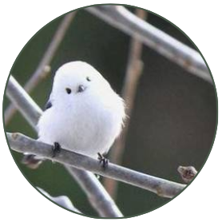 |  |
|                 팀장, KIS API 연동, Redis 연동 API, 전체 및 상세 주식, 챗봇, 랭킹                |        전체 프론트 페이지 개발 (Home, Market, Insight, Portfolio, History)        |                소셜로그인, 인증, 뉴스 API 연동, 워드클라우드, 주식거래(매수/매도), 포트폴리오, 히스토리                |       개발 초기 세팅       |

## 📑 프로젝트 산출물

와이어프레임

1. 로그인 전 메인 페이지  
  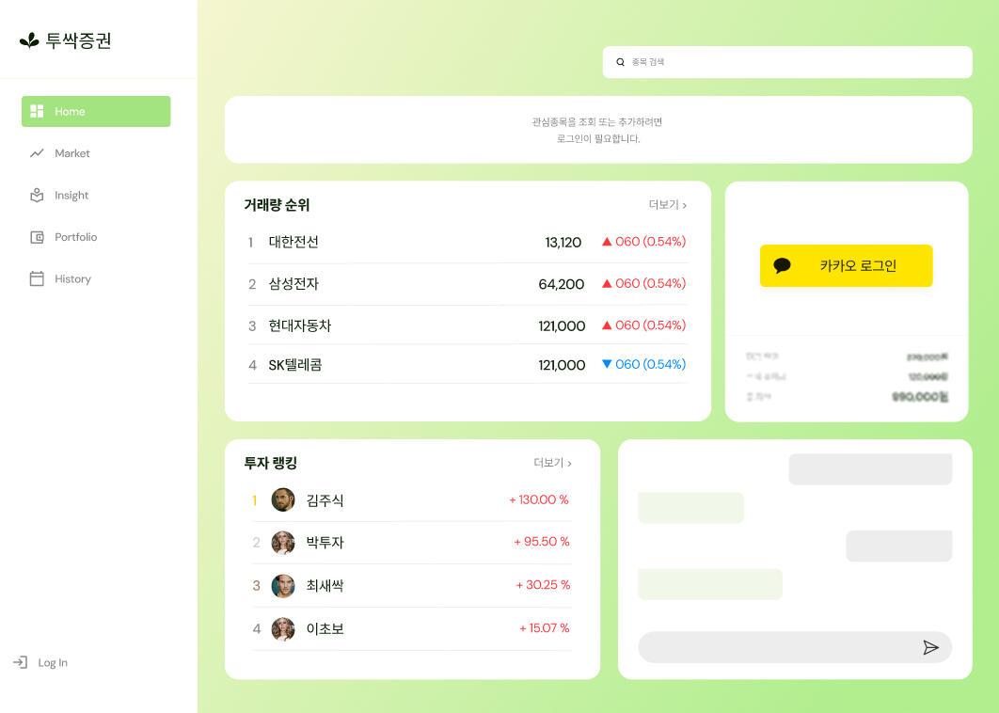
2. 로그인 후 메인 페이지  
  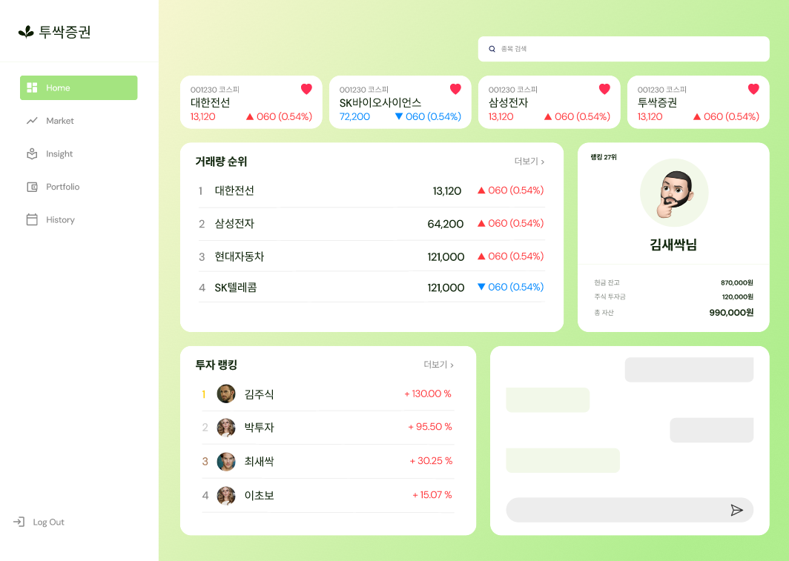
3. 전체 주식 조회  
  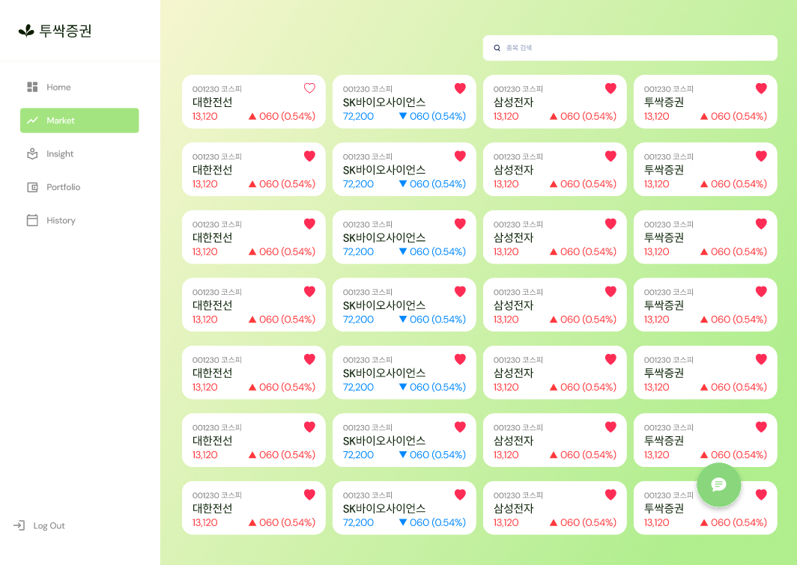
4. 상세 주식 조회  
  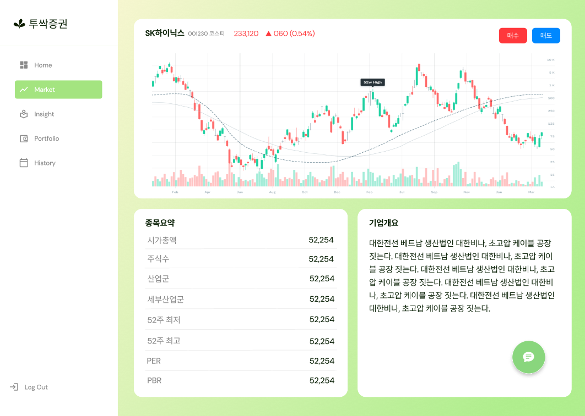
5. 주식 매수  
  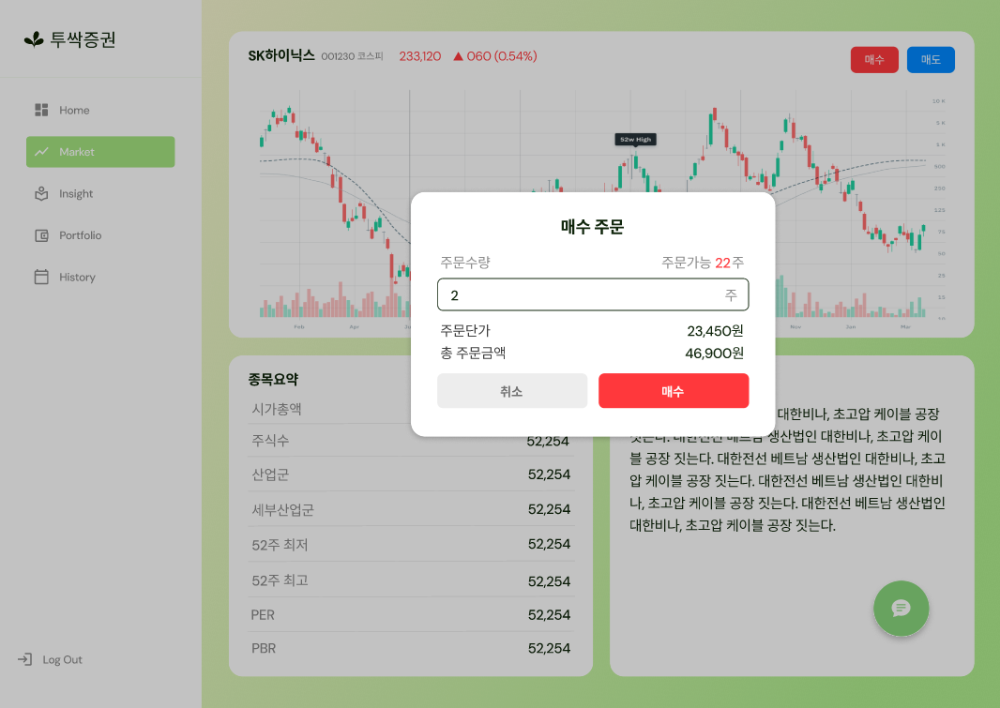
6. 주식 매도  
  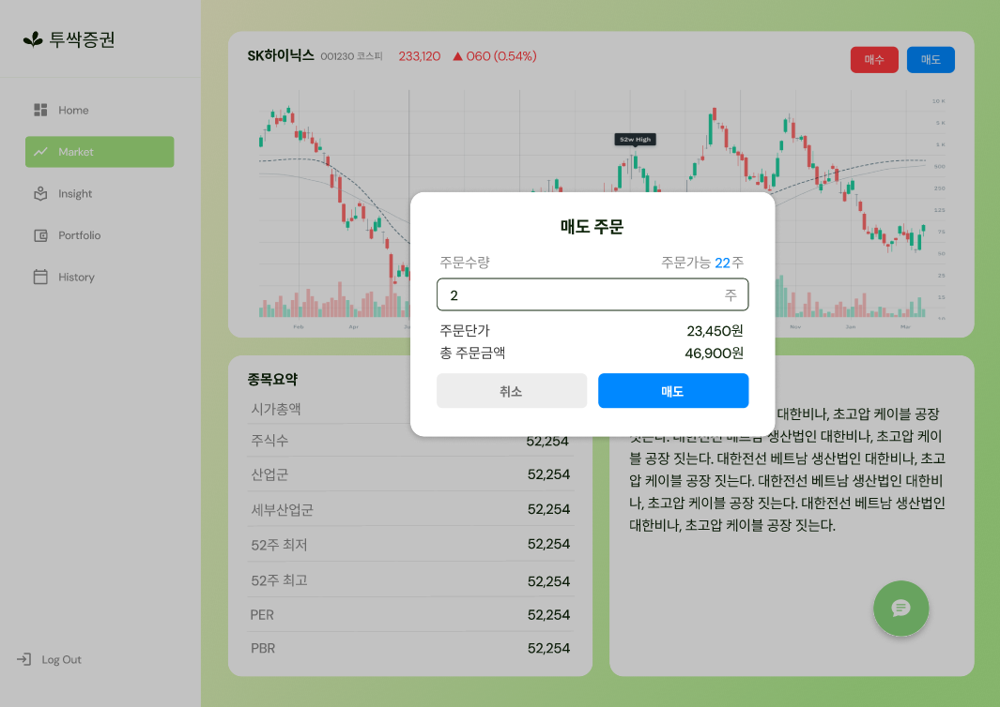
7. HOT 키워드 및 뉴스  
  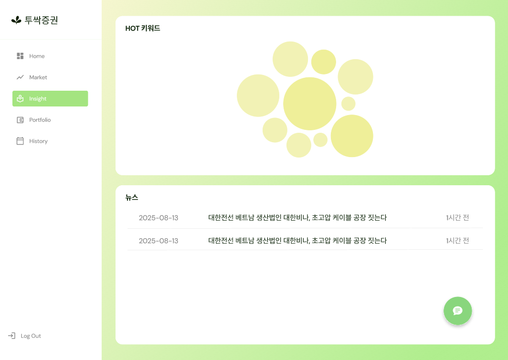
8. 사용자 보유 주식 조회  
  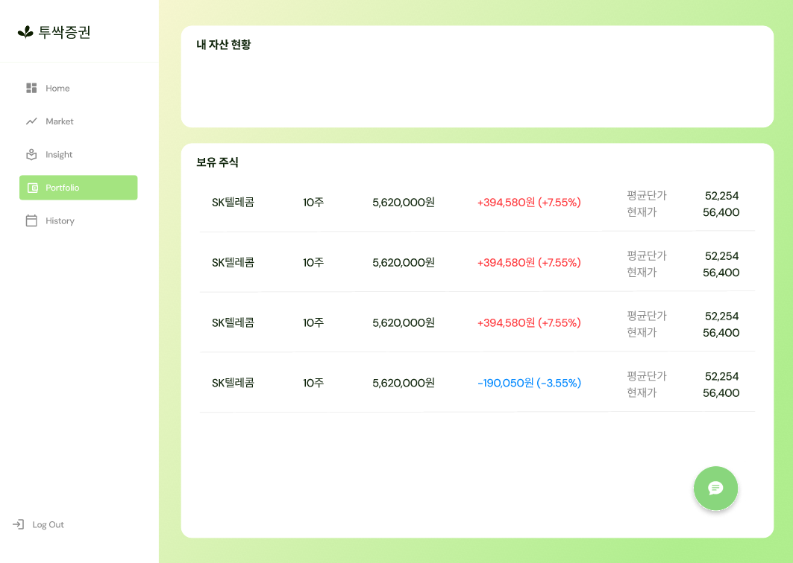
9. 사용자 거래 내역 조회  
  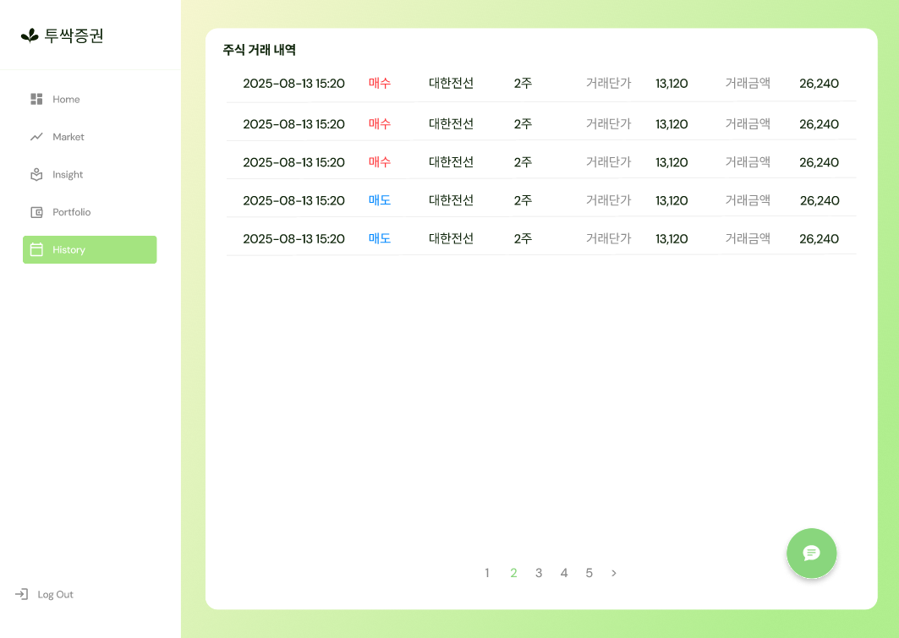
10. 전체 랭킹 조회  
  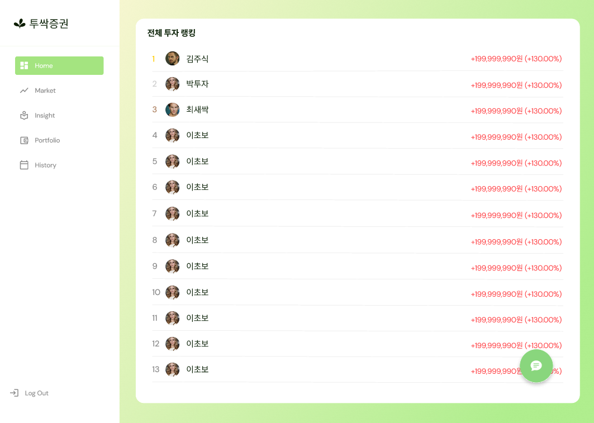

ERD

  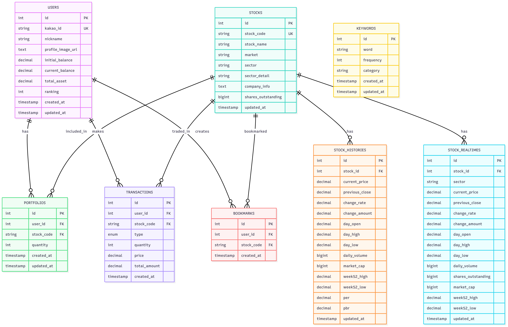

API 명세서

  

아키텍쳐

  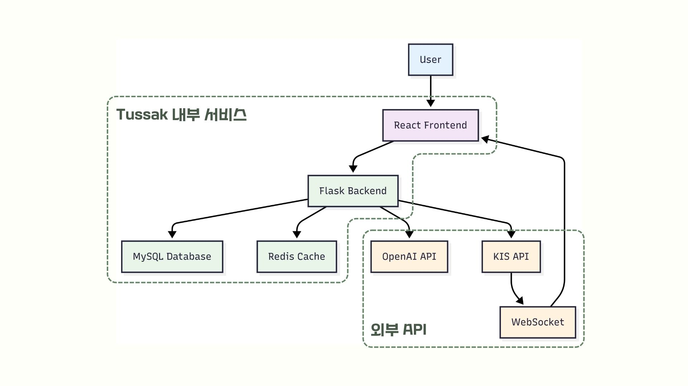

## 🎬 시연영상
[Tussak](https://youtu.be/mJZv8_qBBHc)
